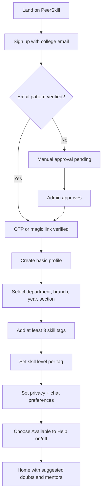
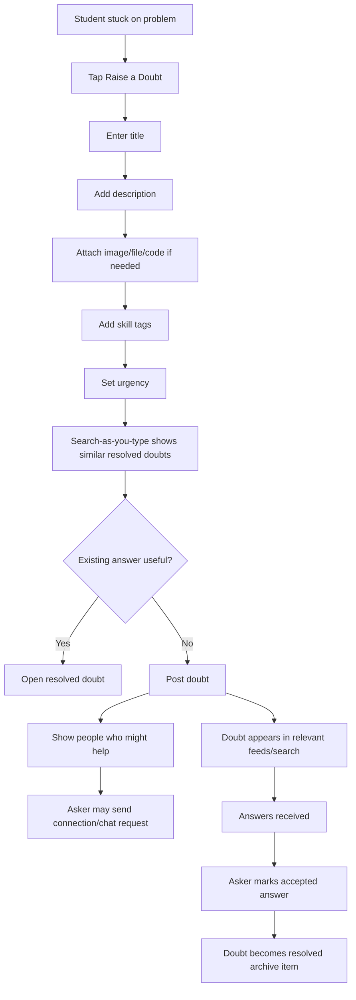
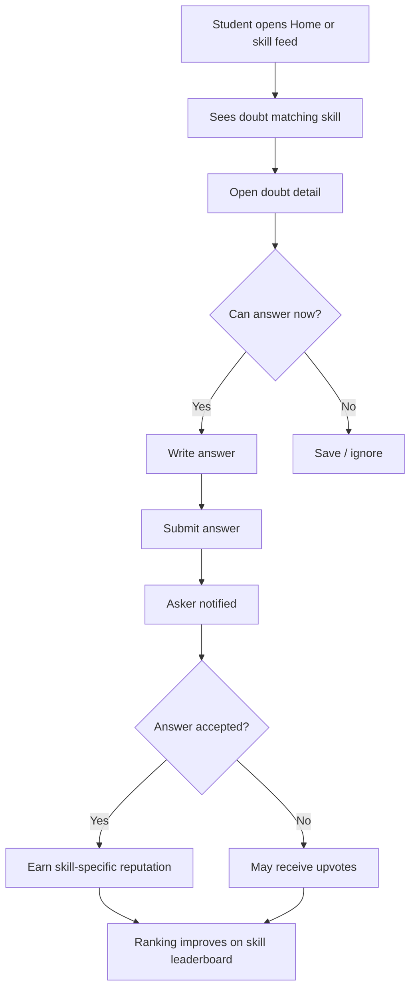
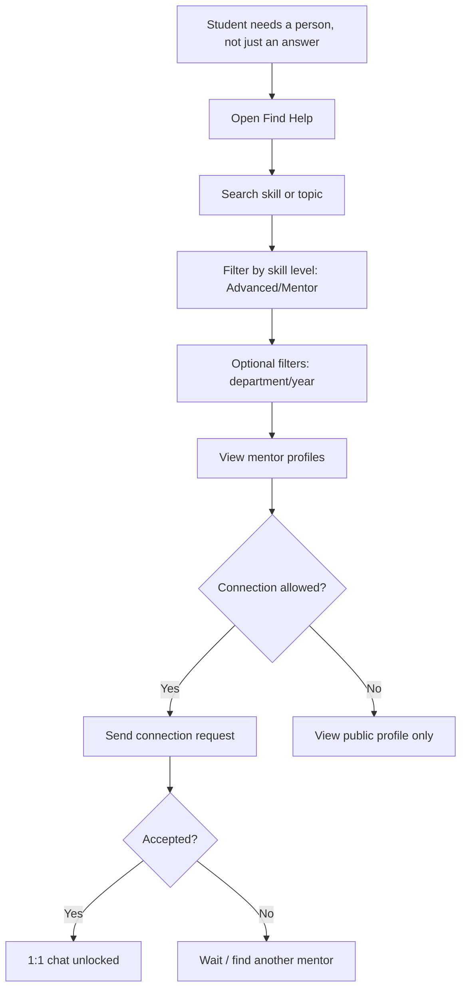
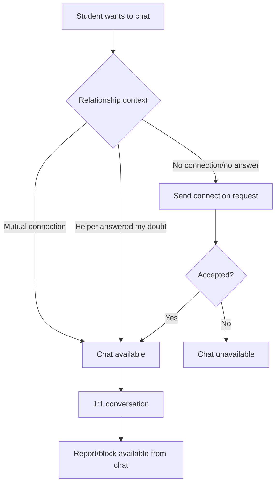

## Core IA / Sitemap
```text
PeerSkill
├─ Auth & Verification
│  ├─ Sign up / Log in
│  ├─ College email OTP / magic link
│  └─ Manual approval pending
│
├─ Onboarding
│  ├─ Basic profile
│  ├─ Department / branch / year / section
│  ├─ Add 3+ skill tags
│  ├─ Set skill levels
│  └─ Privacy + help availability
│
├─ Home
│  ├─ Search
│  ├─ Raise a Doubt
│  ├─ Recent / relevant doubts
│  ├─ Suggested people who can help
│  └─ Notifications
│
├─ Doubts
│  ├─ Raise a Doubt
│  ├─ Doubt detail
│  ├─ Answers
│  ├─ Accepted answer
│  └─ Resolved archive
│
├─ Find Help
│  ├─ Search people
│  ├─ Filter by skill
│  ├─ Filter by department / year
│  └─ Mentor profile preview
│
├─ Messages
│  ├─ Connection requests
│  ├─ 1:1 chat
│  └─ Post-answer chat unlock
│
├─ Profile
│  ├─ Skills + levels
│  ├─ Skill-specific reputation
│  ├─ Doubts asked
│  ├─ Answers given
│  ├─ Privacy settings
│  └─ Available to help toggle
│
├─ Leaderboards
│  └─ Per-skill college-wide ranking
│
├─ Safety
│  ├─ Report post / answer / user
│  ├─ Block user
│  └─ Community guidelines
│
└─ Admin, non-student MVP surface
   ├─ Bulk verification
   └─ Moderation queue
```

## Primary User Flows
### 1. New Student Activation Flow


Success criteria:
- Student completes profile within 48 hours.
- Student adds 3+ skill tags.
- Student sees immediate value on first session.

### 2. Raise a Doubt Flow


Success criteria:
- Doubt posted in under 60 seconds.
- Similar resolved doubts reduce duplicate posting.
- Accepted answer within 24 hours.

### 3. Answer / Help Flow


Success criteria:
- Helpers can identify relevant doubts quickly.
- Answering creates visible recognition.
- Reputation is tied to the specific skill tag.

### 4. Find a Mentor Flow


Success criteria:
- Student can discover someone outside their existing network.
- Supports metric: doubts answered by someone with no prior connection.

### 5. Messaging Unlock Flow


Success criteria:
- Messaging supports help without becoming open DM spam.
- Safety controls remain reachable.

## Key UX Decisions
- Home should prioritize **Search**, **Raise a Doubt**, and **relevant unanswered doubts**, not a general social feed.
- “Find a mentor” should be a top-level student destination because people discovery is part of the product’s differentiation.
- Onboarding should require 3 skill tags before the experience feels complete, matching activation metrics.
- The Q&A archive is the MVP knowledge base; no separate resource library in v1.
- Anonymous posting, social feed, groups, events, badges, and advanced dashboards stay out of MVP.

## Test Plan
Validate with 5-8 institution students across new and existing cohorts:
- Can a new student complete signup and profile setup without explanation?
- Can a student raise a doubt in under 60 seconds?
- Can a helper find a relevant unanswered doubt within 2 minutes?
- Can a student find a mentor for a skill and understand why that person is suggested?
- Do students understand when chat is available and when it is locked?
- Do students notice report/block controls without feeling unsafe?
- Can students distinguish self-rated skill level from earned reputation?

## Assumptions
- MVP is single-institution only.
- Student club handles moderation and manual approvals.
- In-app notifications only for launch.
- Alumni retain access but are not a primary MVP journey.
- Admin tooling is minimal and separate from the student IA.
